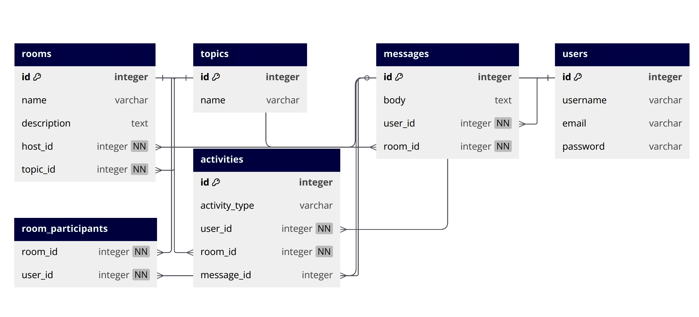

# MeetMind-backend

**MindMeet** is a collaborative learning platform where users can create and join study rooms, participate in discussions, and explore topics of interest. Each room is associated with a specific topic, and users can engage in conversations, ask questions, and share knowledge in real-time. The platform also provides the ability to manage user profiles and track room activities, making it an ideal tool for learners to study together and help each other grow.

---

## Tech Stack

### Backend

- Django
- Django REST Framework
- PostgreSQL
- JWT Authentication

---

## Frontend Repo Link

[MeetMind Backend](https://git.generalassemb.ly/lama-asiri/MeetMind-frontend)

---
## ERD Diagram

## RESTful Routing Table

| URL                                  | Method | Action                             |
| ------------------------------------ | ------ | ---------------------------------- |
| `/api/auth/signup/`                  | POST   | Register a new user                |
| `/api/auth/login/`                   | POST   | Login a user and return JWT token  |
| `/api/rooms/create/`                 | POST   | Create a new study room            |
| `/api/rooms/`                        | GET    | List all study rooms               |
| `/api/rooms/<int:pk>/`               | GET    | View details of a study room       |
| `/api/rooms/<int:pk>/`               | PUT    | Update a study room                |
| `/api/rooms/<int:pk>/`               | DELETE | Delete a study room                |       
| `/api/users/me/`                     | GET    | View current user's profile        |
| `/api/users/<int:pk>/`               | GET    | View a specific user profile       |
| `/api/users/<int:pk>/`               | PUT    | Update a specific user profile     |
| `/api/topics/`                       | GET    | List all available topics          |
| `/api/topics/<int:pk>/`              | GET    | View details of a specific topic   |
| `/api/rooms/<int:room_id>/messages/` | POST   | Post a message in a study room     |
| `/api/messages/<int:pk>/`            | DELETE | Delete a message from a study room |

## User Stories 
- As a user, I can create, update, and delete study rooms.
- As a user, I can join and participate in study rooms.
- As a user, I can post messages in study rooms to engage in discussions.
- As a user, I can update my profile information.
- As a user, I can browse and filter study rooms by topic.
- As a user, I can browse and filter study rooms by topic.
- As a user, I can view all messages in a study room.
- As a user, I can see the topics available for creating or joining study rooms.

## Getting Started/Code Installation

To clone the project up and running on your local machine, follow these instructions:

#### 1. Clone the repo:

- `git clone https://git.generalassemb.ly/lama-asiri/MeetMind-frontend.git`
- `git clone https://git.generalassemb.ly/lama-asiri/MeetMind-backend.git`

#### 2. Install backend dependencies:

Install Pipenv (if you don’t have it already):

- `pipenv install`

Navigate to the backend directory and install dependencies:

- `cd backend-project`
- `pipenv install`

#### 3. Set up database:

Create and activate the virtual environment:

- `pipenv shell`

Make migrations and migrate the database:

- `python3 manage.py makemigrations`
- `python3 manage.py migrate`

### 4. Start the Django development server:

- `python3 manage.py runserver`

#### 5. In a new terminal, navigate to the frontend directory and install dependencies:

- `cd MeetMind_frontend`
  
- `npm install`

#### 6. Start the React development server:

- `npm run dev`

## IceBox Features
- Study Room Scheduling
Allow hosts to plan sessions and notify participants.

- Room Recording and Replay
Save and rewatch valuable study sessions.

- Collaborative Whiteboard or Code Editor
Include tools for real-time note-taking or pair programming.

- Private Rooms & Invitation-Only Access
Support focused group work with privacy controls.

