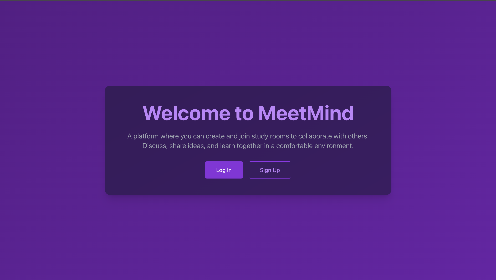
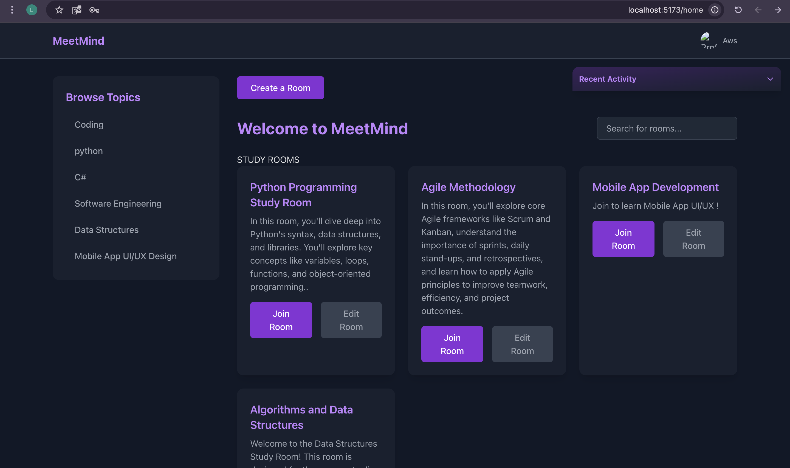
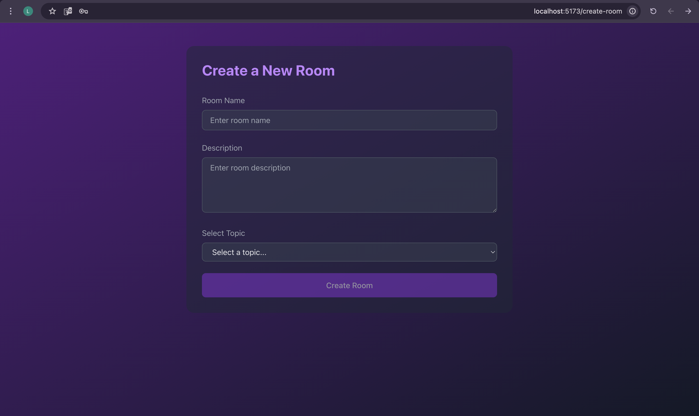
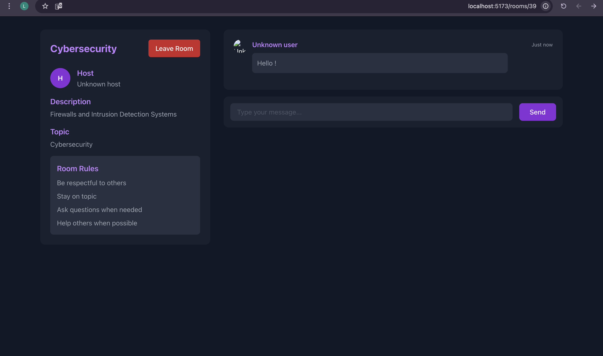

# MeetMind-frontend

**MindMeet** is a collaborative learning platform where users can create and join study rooms, participate in discussions, and explore topics of interest. Each room is associated with a specific topic, and users can engage in conversations, ask questions, and share knowledge in real-time. The platform also provides the ability to manage user profiles and track room activities, making it an ideal tool for learners to study together and help each other grow.

---

## Tech Stack

### Frontend

- ReactJs
- React-Router
- Axios
- Tailwind CSS

---

## BackEnd Repo Link

[MeetMind Backend](https://git.generalassemb.ly/lama-asiri/MeetMind-backend)

---

## Getting Started/Code Installation

To clone the project up and running on your local machine, follow these instructions:

#### 1. Clone the repo:

- `git clone https://git.generalassemb.ly/lama-asiri/MeetMind-frontend.git`
- `git clone https://git.generalassemb.ly/lama-asiri/MeetMind-backend.git`

### 2. Set up the backend:

`cd backend_project`

`pipenv install`

`python manage.py runserver`

### 3. Set up the frontend:

`cd MeetMind_frontend`

`npm install`

### 4. Start the frontend React development server:

`npm run dev`

---

## Screenshots 

### Landing Page 

  

----

### home page 

  

-----

### create room

  

 
 ----

### study room

  

 
 ----

## IceBox Features
- Study Room Scheduling
Allow hosts to plan sessions and notify participants.

- Room Recording and Replay
Save and rewatch valuable study sessions.

- Collaborative Whiteboard or Code Editor
Include tools for real-time note-taking or pair programming.

- Private Rooms & Invitation-Only Access
Support focused group work with privacy controls.
