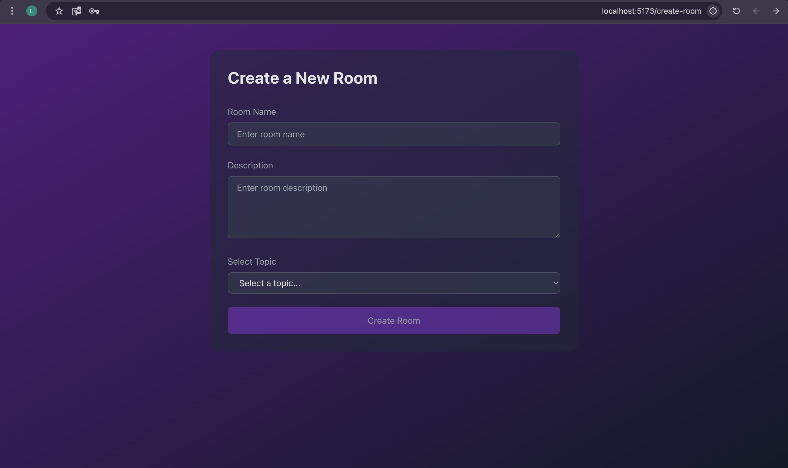

# MeetMind

**MindMeet** is a collaborative learning platform where users can create and join study rooms, participate in discussions, and explore topics of interest. Each room is associated with a specific topic, and users can engage in conversations, ask questions, and share knowledge in real-time. The platform also provides the ability to manage user profiles and track room activities, making it an ideal tool for learners to study together and help each other grow.

---

## User Stories

- As a user, I can register and log in with my email and password.
- As a user, I can create, update, and delete study rooms.
- As a user, I can join and participate in study rooms.
- As a user, I can post messages in study rooms to engage in discussions.
- As a user, I can view my profile and see all the rooms I have created or joined.
- As a user, I can update my profile information.
- As a user, I can browse and filter study rooms by topic or keyword.
- As a user, I can view all messages in a study room.
- As a user, I can see the topics available for creating or joining study rooms.

---

## Tech Stack

### Backend

- Django
- Django REST Framework
- PostgreSQL
- JWT Authentication

### Frontend

- Axios
- React Router
- react-router-dom
- Tailwind

## Screenshots of the Application Flow
### Welcome Page (Public View)

Shows the platform and its main features.

---

### Login Page

Existing users can log in with their email/username and password, while new users can sign up easily.

---

### Home Page

The Home Page provides quick access to study rooms, your profile, topics, and the Create Room button. It also shows recent activity notifications to keep you updated on your latest actions.

---

### Create room Page

Create Room page allows you to set up a new study room by specifying a topic, name, and description.

---

### Study room page

Study Room page allows users to send messages, participate in discussions, and interact with others. It also features a Leave button to exit the room at any time.

---

### Recent activity 

Recent Activity section displays notifications of your actions, including when you edit or delete rooms, keeping you updated on your latest changes.

--- 

## Getting Started/Code Installation

To clone the project up and running on your local machine, follow these instructions:

#### 1. Clone the repo:

- `git clone https://git.generalassemb.ly/lama-asiri/MeetMind-frontend.git`
- `git clone https://git.generalassemb.ly/lama-asiri/MeetMind-backend.git`

#### 2. Install backend dependencies:

Install Pipenv (if you don’t have it already):

- `pipenv install`

Navigate to the backend directory and install dependencies:

- `cd backend-project`
- `pipenv install`

#### 3. Set up database:

Create and activate the virtual environment:

- `pipenv shell`

Make migrations and migrate the database:

- `python3 manage.py makemigrations`
- `python3 manage.py migrate`

### 4. Start the Django development server:

- `python3 manage.py runserver`

#### 5. In a new terminal, navigate to the frontend directory and install dependencies:

- `cd MeetMind_frontend`
  
- `npm install`

#### 6. Start the React development server:

- `npm run dev`

## IceBox Features
- Study Room Scheduling
Allow hosts to plan sessions and notify participants.

- Room Recording and Replay
Save and rewatch valuable study sessions.

- Private Rooms & Invitation-Only Access
Support focused group work with privacy controls.

